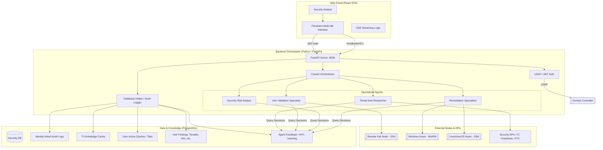

# 🤖 Gemini CLI: Centralized Internal Security Hub

This project is a centralized **Internal Security Hub** featuring a persistent React Web Portal and a CrewAI-powered Backend Orchestrator. It empowers security teams to correlate data, automate investigations, and execute remediation from a unified interface.

## 🏗️ Architecture

The system utilizes a 3-tier architecture for multi-user internal access.



---

## 🌟 Key Features

- **Human-in-the-Loop (HITL) Feedback**: Capture analyst approvals/denials in real-time. Agents query this feedback before every action to learn and respect historical constraints.
- **Hybrid Authentication**: Support for both **LDAP/Active Directory** and **Local User Fallback**. The system remains accessible via local admin even if domain controllers are unreachable.
- **Persistent Multi-tab UI**: Investigations are saved to PostgreSQL and persist across sessions.
- **Identity-linked Auditing**: Every agent action and tool execution is logged with the analyst's domain username.
- **Automated Evidence Logic**: Real-time extraction of IPs, Domains, and Hashes from streaming responses.
- **TI Knowledge Cache**: Shared 24-hour cache for threat intelligence lookups to reduce API costs and latency.
- **Remote Remediation**: One-click remote patching for Windows (WinRM) and Linux (SSH).
- **Offensive Offloading**: Automated execution of Metasploit and Searchsploit on a dedicated Kali node.

---

## ⚙️ Setup & Installation

### 1. Prerequisites
- **PostgreSQL**: Version 13+ (Uses `gen_random_uuid()`).
- **Python**: 3.12+
- **Node.js**: 20+

### 2. Backend Installation
```bash
cd backend
python3.12 -m venv venv
source venv/bin/activate
pip install -r requirements.txt
# Add asyncpg and crewai[google-genai]
pip install asyncpg "crewai[google-genai]"
```

### 3. Environment Configuration
Create `backend/.env` with the following:
```bash
# Core
GEMINI_API_KEY=your_key_here

# Database
POSTGRES_HOST=localhost
POSTGRES_PORT=5432
POSTGRES_DATABASE=security_db
POSTGRES_USER=postgres
POSTGRES_PASSWORD=your_password

# Authentication
LDAP_SERVER=ldap://your-domain-controller
LDAP_BASE_DN=dc=example,dc=com
LDAP_USER_DN_TEMPLATE=uid={username},ou=users,dc=example,dc=com
JWT_SECRET_KEY=generate-a-secure-key-here

# Security Tooling
VIRUSTOTAL_API_KEY=...
GREYNOISE_API_KEY=...
OTX_API_KEY=...
```

### 4. Database Initialization
```bash
cd backend/database
python init_db.py
```

### 5. Frontend Installation
```bash
cd frontend
npm install
npm run dev
```

## 🛠️ Usage

1.  **Access the Portal**: Open `http://localhost:5173` (default Vite port).
2.  **Authenticate**: Use your Domain/LDAP credentials.
3.  **Active Queries**: Start a "New Query" to initiate an agentic investigation. All progress is automatically saved.
4.  **Evidence Drawer**: Click on extracted indicators in the right pane to drill down into specific TI data.

---

## 🔒 Security & Privacy

- **Sensitive Data Filter**: Automatically masks IPv4 last octets, email usernames, and API keys in audit logs and DB writes.
- **Whitelisting**: All external probes originate from the Hub's static IP.
- **Command Sanitization**: All remote execution commands (SSH/WinRM) are sanitized using `shlex` and `shlex.quote`.
