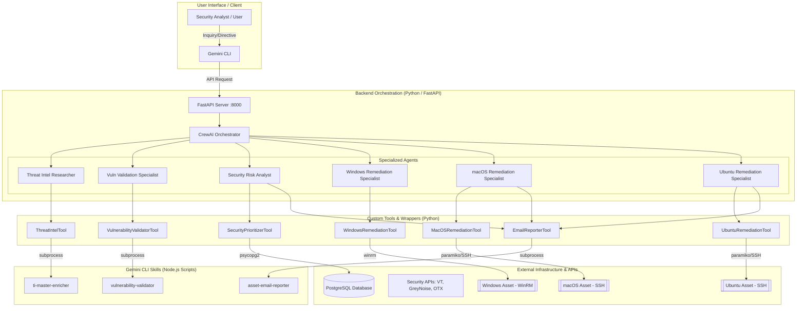

# 🤖 Gemini CLI: Security Orchestrator & TI Skills Workspace

This project is a centralized repository for specialized **Gemini CLI Skills** and a **CrewAI-powered Backend Orchestrator** focused on security operations, threat intelligence, and automated remediation.

## 🏗️ Architecture

The system bridges the gap between high-level agentic orchestration and low-level security tools through a modular "Skill" architecture.



---

## 🚀 Featured Skills

| Skill Name | Purpose | Key Data Sources |
| :--- | :--- | :--- |
| **`security-prioritizer`** | Correlates & ranks vulnerabilities based on risk. | Tenable, Wiz, CISA KEV, phpIPAM |
| **`vulnerability-validator`** | Validates vulnerabilities via active scans. | Nuclei, Nmap |
| **`ti-master-enricher`** | Orchestrates multi-source TI lookups (Consensus). | GreyNoise, OTX, VirusTotal |
| **`virustotal-checker`** | Threat reputation for IPs and Domains. | VirusTotal API v3 |
| **`greynoise-community`** | Identifies internet background noise/scanners. | GreyNoise Community API |
| **`alienvault-otx`** | Checks indicators against threat pulses. | AlienVault OTX API |
| **`chronicle-query`** | Queries SIEM events and detections. | Google Chronicle API |
| **`rapid7-siem`** | Queries investigations and logs in InsightIDR. | Rapid7 InsightIDR |
| **`talos-intelligence`** | Reputation lookups from Cisco Talos. | Talos Intelligence |
| **`csv-writer`** | Exports JSON data to CSV files. | Local Node.js Script |

---

## ⚙️ Setup & Installation

### 1. Backend Orchestrator (Python)
Requires Python 3.12+.
```bash
cd backend
python -m venv venv
source venv/bin/activate
pip install -r requirements.txt
python main.py
```

### 2. Gemini CLI Skills (Node.js)
Requires Node.js and the Gemini CLI.
```bash
npm install
# Install individual skills into the CLI
gemini skills install ./<skill-name>.skill --scope user
```

### 3. Environment Configuration
Copy `backend/.env.example` to `backend/.env` and provide your API keys:
- `GEMINI_API_KEY`: Core LLM orchestration.
- `VIRUSTOTAL_API_KEY`, `GREYNOISE_API_KEY`, `OTX_API_KEY`: Threat Intelligence.
- `CHRONICLE_CUSTOMER_ID`, `GOOGLE_APPLICATION_CREDENTIALS`: Chronicle SIEM.
- `RAPID7_API_KEY`, `RAPID7_REGION`: Rapid7 InsightIDR.
- `POSTGRES_*`: For the Security Prioritizer database.
- `WINRM_*`, `MACOS_SSH_*`, `UBUNTU_SSH_*`: Credentials for automated remediation.

## 🛠️ Usage

1.  **Direct CLI Interaction**: Use natural language in the Gemini CLI to trigger specific skills (e.g., "Enrich IP 8.8.8.8").
2.  **API-Driven Orchestration**: The backend exposes a `/api/orchestrate` endpoint that uses CrewAI agents to perform multi-step security investigations and remediation.

For detailed development workflows, see [GEMINI.md](GEMINI.md).
