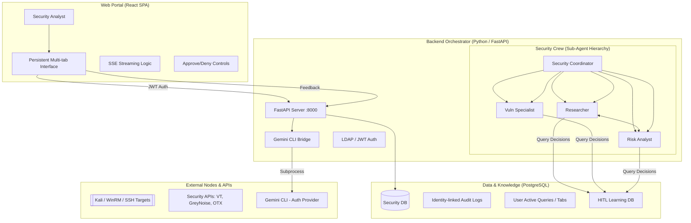

# 🤖 Gemini CLI: Centralized Internal Security Hub

This project is a centralized **Internal Security Hub** featuring a persistent React Web Portal and a CrewAI-powered Backend Orchestrator. It empowers security teams to correlate data, automate investigations, and execute remediation from a unified interface.

## 🏗️ Architecture

The system utilizes a 3-tier architecture with a specialized **Sub-Agent Delegation** model.



---

## 🌟 Key Features

- **Sub-Agent Delegation Architecture**: Managed by a `SecurityCoordinator`, specialized agents (Researcher, Risk Analyst, etc.) can now autonomously delegate tasks to one another for complex cross-functional investigations.
- **Human-in-the-Loop (HITL) Feedback**: A formal feedback loop where agents query the `agent_feedback` table before *every* task. Human approvals/denials take precedence over agent logic.
- **Gemini CLI Bridge**: **No API keys required in code.** The backend leverages your local `gemini` CLI session for LLM access, improving security and simplifying credential management.
- **Hybrid Authentication**: Support for both **LDAP/Active Directory** and **Local User Fallback** (initial setup via `admin/password123`).
- **Persistent Multi-tab UI**: All investigations and tab states are synced to PostgreSQL, allowing analysts to resume work from any device.
- **Identity-linked Auditing**: Every action is logged with the analyst's domain username, including automatic PII masking of sensitive data (IPs, emails, keys).
- **Remote Remediation**: One-click patching and software updates for Windows (WinRM), Linux (SSH), and macOS (SSH).

---

## ⚙️ Setup & Installation

### 1. Prerequisites
- **Gemini CLI**: Installed and authenticated (`gemini` command should work).
- **PostgreSQL**: Version 13+ (Uses `gen_random_uuid()`).
- **Python**: 3.12+
- **Node.js**: 20+

### 2. Backend Installation
```bash
cd backend
python3 -m venv venv
source venv/bin/activate
pip install -r requirements.txt
```

### 3. Environment Configuration
Create `backend/.env` with the following:
```bash
# --- Gemini CLI Bridge ---
# Optional if logged into 'gemini' CLI. 
# GEMINI_API_KEY=AIzaSy...

# --- Database Credentials ---
POSTGRES_HOST=localhost
POSTGRES_PORT=5432
POSTGRES_DATABASE=security_db
POSTGRES_USER=postgres
POSTGRES_PASSWORD=your_password

# --- Authentication ---
JWT_SECRET_KEY=generate-a-secure-key-here
JWT_ALGORITHM=HS256

# --- Security APIs ---
VIRUSTOTAL_API_KEY=...
GREYNOISE_API_KEY=...
OTX_API_KEY=...
```

### 4. Database Initialization
```bash
cd backend/database
python init_db.py
```

### 5. Frontend Installation
```bash
cd frontend
npm install
npm run dev
```

## 🛠️ Usage

1.  **Access the Portal**: Open `http://localhost:5173` (default Vite port).
2.  **Authenticate**: Use your Domain/LDAP credentials.
3.  **Active Queries**: Start a "New Query" to initiate an agentic investigation. All progress is automatically saved.
4.  **Evidence Drawer**: Click on extracted indicators in the right pane to drill down into specific TI data.

---

## 🔒 Security & Privacy

- **Sensitive Data Filter**: Automatically masks IPv4 last octets, email usernames, and API keys in audit logs and DB writes.
- **Whitelisting**: All external probes originate from the Hub's static IP.
- **Command Sanitization**: All remote execution commands (SSH/WinRM) are sanitized using `shlex` and `shlex.quote`.
